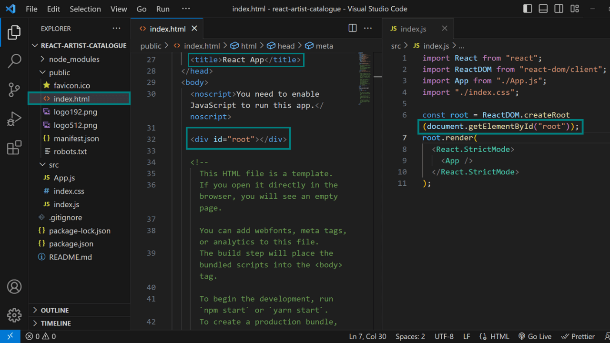

# Extreme React Guide For Designing Premium Websites ♡

## Introduction

### Live Demo

[https://wasimapinjari.github.io/react-artist-catalogue](https://wasimapinjari.github.io/react-artist-catalogue)


### Screenshot


### What To Expect From This Guide

This guide is extreme. We're going to build a beautiful React project and deploy it on GitHub Pages from start to finish. 

This is a long article (15,000+ words) because I wanted to detail the whole process and not left anything important out.

The curse of knowledge is we often assume other people know what we know. It look so obvious for anyone to know about it. My goal is to not fall for it.

I also added bonus content in the end which are answers to questions that I often get asked by fellow developers. Enjoy!


## Content

- Introduction 
- Gathering Resources
  - Coming Up With An Idea
  - Asking ChatGPT For Data
  - Converting Data Into An Array
  - Searching Images
  - Cropping Images
  - Resizing Images 
- Setting Up React Project
  - Prerequisites
  - Installing Cool Terminal [Optional]
  - Creating Our React Project
  - Starting Local Development Environment
  - Deleting Files & Code
  - Injecting React In HTML Page
  - Adding Global CSS Properties
- Building React Project
  - Creating The Root App Component
  - Creating The Header Component
  - Adding Data
  - Creating The Main component
  - Creating The Artist Component
  - Component Tree
  - Selecting Fonts
  - Selecting Colors
  - Revisiting The Images
  - Compressing Images
  - Advance Optimizations
  - Readjusting The website
  - Rearranging Data
  - Making The Website Responsive
  - Adding Custom Favicon
  - Privacy
  - Security
- Deploying To GitHub Pages
  - STEP A: Installing GitHub Pages Node Package
  - STEP B: Modifying The JSON File
  - STEP C: Creating A New GitHub Repository 
  - STEP D: Getting Access To GitHub Repositories
  - STEP E: Configuring Git Username & Email
  - STEP F: Authenticating Using Token
  - STEP G: Caching GitHub Credentials + How To Delete Them
  - STEP H: Pushing Current Project On The GitHub Repository
  - STEP I: Deploying Repository To GitHub Pages
  - STEP J: Navigating To Deployed GitHub Page
  - Revealing The Size Of The Website Page
- Bonus Content [Optional]
  - How To Learn
  - Dealing With Perfectionism
  - Sharing & Applying Knowledge
  - Learning & Memorization
  - How To Deal With Motivation

## Gathering Resources

### Coming up with an idea

First I come up with an idea of what I wanted to create. After some thinking I decided to render a list of data in React. It's simple enough that we will not get demotivated with complexity and lose interest. But I don't have any data.

### Asking ChatGPT for Data

I proceed to ask ChatGPT for dummy data. It gave me a dummy data set but I wasn't satisfied. It was too random for anyone to care including myself. I took a deep sigh after staring at my laptop for some time.

I had an idea to ask ChatGPT to give me celebrity artists' data. It gave me 3 different celebrity profiles, I asked to give me at least 10. The data looked quite promising because I didn't know that information about those celebrities myself and I was curious to know that. So I went with this data set.

### Converting data into an array

I started painstakingly typing out the data in a JavaScript array containing information about each celebrity profile in an individual object then I realize out of nowhere that the ChatGPT can do the work for me. I ask ChatGPT to convert the data into a JavaScript array and voila! I have my data.


### Searching Images

The next step was to search celebrity images. My Google search query look like this: Rihanna portrait white background. There are 10 celebrity images I need but I got tired of searching for the perfect image and I also thought they are too many. So I decided to omit 2 celebrity and work with 8 data profiles instead of 10.

### Cropping Images


I downloaded all the celebrity images I like the best. The only thing I hate was I thought this project was easier and less time-consuming than it turned out. It felt as if I was hit with brick of reality.

The images I downloaded were of different dimensions (height and width). I crop each one of them in a perfect square and made sure the celebrity face is in the center of the square.

Cropping images fix half of the problem. By that I mean it fixed the problem of aspect ratio. The images that were of dimensions of desktop landscape wallpaper (1080 px x 1920 px) are now a perfect square (1080 px x 1080 px). Here px stands for pixels which is a way of measuring images.

What cropping doesn't fix is the dimensions themselves. So the image size (disk space an image takes to store itself) depends on the dimensions (height and width) of the image.

The bigger the dimension, the more space it takes, thus the bigger the size of an image.

### Resizing Images


Currently, the images are of different sizes some of them are around 400 KB, and others 3 MB to 4 MB. The different sizes are due to me downloading images from different sources with that comes images with varying dimensions. I might download a celebrity full body image of dimension 1080 px x 1920 px (size: 2 MB) and crop only the face creating a 560 px x 560 px (size: 400 KB) image.

This is bad because we want our website to load fast and for that, we must reduce the size of images. Because whenever a person visits our website they essentially download our website and we don't want them to download a gigantic 10 MB website. Here is why:

- People are visiting our website from different locations with varying internet speeds.

- So let's assume the worst-case scenario: If someone has terrible internet speed they won't be able to download our website fast. Their patience will run out trying to download our website and they will leave before we even get a chance to present our website.

- Ideally, you want your website page size to be as small as possible, the smaller the page size the faster your website will be downloaded. Try to keep it around 1.5 MB. This is a general guideline feel free to have a website of 300 KB or even 3 MB.

- You can check the size of a web page by entering the URL in this tool: https://tools.pingdom.com currently if you enter the Github URL: https://github.com then you will find that the current web page size is 2.1 MB. This will change in the future as they redesign the web page but you get the idea.


- Most of the time images are the leading cause of gigantic web page size that significantly slows down the website load speed.


---

We're going to resize and compress all of our images in the end as a finishing touch to our website because we currently don't know how much screen space (in height and width) we will allow these images to take on our website.

Let's move on...

## Setting up React Project

### Prerequisites

Before getting started let's make sure you have Node and Git installed and after that make sure you have npx installed in node.
1. Go to https://nodejs.org and install the LTS version (recommended for most users) of the node.
2. Go to https://git-scm.com and install Git by clicking on the next button of the installer until you hate your life.
3. Install npx by typing the below command in the terminal.

```bash
npm i -g npx
```

Here i stands for install, -g is a flag that will install this package globally so that you don't have to keep installing it all the time and npx stands for Node Package eXecute, it is simply an NPM package runner. It allows developers to execute any Javascript Package available on the NPM registry without even installing it and for those curious people out there NPM registry is just a database of JavaScript packages which contains software and metadata (data about the data is called metadata).

### Installing Cool Terminal [Optional]

This is optional but I highly recommend downloading this cool looking terminal, especially if you're on windows because their command line looks quite ugly.

So download it by visiting: https://hyper.is

If you do decide to download it I want you to set things up a bit.

1. First make sure you have Git installed as I already told you in prerequisites.
2. Go to https://gist.github.com/coco-napky/404220405435b3d0373e37ec43e54a23 and copy the text inside hyper.js file.
3. Open Hyper and click on the hamburger icon, which is basically 3 small horizontal lines at the top left of the hyper application.
4. Go to `Edit` and then `Preferences`.
5. This will open the hyper.js file and what you have to do now is select all the text and replace with the text that you copied previously from GitHub.
6. Save the file.
7. Restart the Hyper application by closing and reopening it again and you're done! Welcome your new awesome terminal.


### Creating Our React Project

You might have downloaded the terminal that I suggested. You can now go ahead and right click on the desktop and click on `Open hyper here` to open up hyper on Desktop. 

I use Windows and you can probably do the same in Mac. Or alternatively you can open hyper terminal using search and navigate to the Desktop by running `cd` (change directory) command like so:

```bash
cd ~/Desktop
```
Here `~` represents home directory of currently logged in user followed by the path of destination within the home directory. You don't need to type it if you're already in home directory.


Now let's finally create our React project on Desktop with the name: `react-artist-catalogue` using the `create-react-app` tool. This tool helps us set up React project quickly and run it in a local development environment.

```bash
npx create-react-app react-artist-catalogue
```
You can copy-paste this command using Ctrl (Mac: Command) + C and paste it in Hyper using Ctrl (Mac: Command) + Shift + C. 

You may get prompted before installation to confirm the installation if you do get that prompt then type "y" for confirming yes you do want to install it and then press Enter.

I am using VS Code as a code editor. Which you can install by going to: https://code.visualstudio.com and feel free to use whatever code editor you like. 

After installation is done you can get inside the project folder through command line by using `cd` command and open it in VS Code by running `code .` command. As you start typing project folder name after few letters press Tab key in your keybord to autocomplete. 
```bash
cd react-artist-catalogue
code .
```
Here `.` means open the current folder in the VS Code. If you want to open specific file then you can do it by specifying the file name in the current folder you are in like so: `code README.md` and this will open the specific file in VS Code instead of the whole folder.


### Starting Local Development Environment

Step to start local development environment: 

1. Open the terminal in VS code by going to the VS code menu on the top left of VS code application window and in that click on view tab and then click on Terminal or alternatively press Ctrl (Mac: Command) + ` (Backtick) key on the keyboard.


2. Click on the down angular bracket icon and then on `"Select Default Profile"` in the top left of opened terminal window.


3. Select the Git Bash as your default terminal. You only have to do it once after that whenever you click on + (plus) icon which was on the left side of the down angular bracket icon a Git Bash terminal will open for you to type your commands in.


4. Now to start our React local development environment type and run this command in the terminal:

```bash
npm start
```


You can manually type https://localhost:3000 in your browser's search bar to open up the React application you're working on or alternatively press Ctrl (Mac: Command) button on the keyboard and click on the link in the terminal to open the React local development environment in the default browser.

You can change the default browser in setting on your OS (operating system). For windows search for default apps and scroll down to select web browsers and change it. There may be similar process for other OS.


### Deleting Files & Code

The first thing I did is deleting unnecessary files from the src folder. I only kept 3 files: `index.js`, `index.css` and `App.js`.

I then went ahead and deleted everything that was written inside both files so that I end with empty files.


### Injecting React In HTML Page

In the `index.js` file I wrote the basic boilerplate (reusable) code to inject React in the pre-written (by the create-react-app tool) HTML page which is located in the public folder. To be specific we inject React in the div element with the id: `root` written in the HTML page. 

This is also a good time for you to change the title of the page in HTML document from `React App` to `Artist Catalogue`.




```js
// index.js

import React from "react";
import ReactDOM from "react-dom/client";
import App from "./App.js";
import "./index.css";

const root = ReactDOM.createRoot(document.getElementById("root"));
root.render(
  <React.StrictMode>
    <App />
  </React.StrictMode>
);

// we are going to use let and const to declare variables. Here let will let you change the variable while const will keep the variable constant throughout the code. As a side note when you declare arrays or object with const, it will prevent you from replacing the arrays or objects with something else but it does allow you to modify the array and object inside itself.
```
Here I imported React which will help us compile the React code into JavaScript behind the scenes and ReactDOM which will help us create a Virtual React DOM since all the React components (for example: `<React.StrictMod>` and `<App>`) are written in the HTML syntax (to be precise JSX syntax which I will explain later) as if they are HTML elements and just like HTML has a DOM (Document Object Model) where you can see all HTML elements of web page in the form of tree structure by opening the browser's developer tools by manually searching for it in browser menu or by pressing Ctrl + Shift + I (Windows) or Option + Command + I (Mac) keyboard shortcut to bring that up for most browsers.


HTML DOM looks like this:


While React Virtual DOM looks like this (I will explain this later in detail and the process to install it):


I also imported our `index.css` and `App.js` file which is located in the same folder. I wrap the App component with React.StrictMode component because by doing that React will run the code twice and a second time just to make sure there are no errors and bugs in our application and if there are then it will give us warnings.

### Adding Global CSS Properties

```css
/* index.css */

* {
  margin: 0;
  padding: 0;
  box-sizing: border-box;
}

html {
  font-size: 62.5%;
}
```
Here by using the * selector, I am setting the same CSS property to all elements present in the HTML. All browsers have a default stylesheet called user agent stylesheet that gets applied to HTML elements even if you don't set any styles yourself. 

We change box-sizing to border-box because by default it is set to content-box. So by default CSS consider border and padding different from actual element so if you create a element with height and width of 100 px x 100 px with black 5 px solid border and padding of 10 px all round, then you will think your element is 100 px in height and width but that's not how content-box works the height and width of the element is actually 130 px. Let see how the calculation of width works: 5 px left border + 10 px left padding + 100 px element width + 10 px right padding + 5 px right border = 130 px width of overall element. 

What we want instead is to be able to specify height and width in css and have that actual height and width render. We want the border and padding to be included in height and width of the element. To do that we will simply set box-sizing to border-box. Now the calculation will look like this: 5 px left border + 10 px left padding + 70 px element width + 10 px right padding + 5 px right border = 100 px width of overall element.

Let's talk about font-size: I set font size to 62.5% because I want to create responsive web design and for that I will use reponsive units which is rem (which is also called as root em and em is just a reference to the width of capital letter "M" of font used) and 1 rem is equal to 16 px. So if I had to create 50 px height and width box then I had to go to this weird calculation like 50 px divide by 16 is equal to 3.125 rem in order to convert px in rem units. To fix that we will change the defaullt setting of 1 rem is equal to 16 px and find a way to make 1 rem is equal to 10 px so making calculation will be easier like 50 px divided by 10 will be 5 rem. Currently 100% is equals to 16 px so 100 divide by 16 and multiplied by 10 is 62.5%.

## Building React Project 

### Creating The Root `App` Component

I created a new file called App.js inside src folder and created App component inside the file. Now the game plan is to create 2 components within our main root App component: `Header` and `Main`.

1. The `Header` component will contain the main primary heading of our website.
2. The `Main` component will contain the rest of the website by that I mean the secondary heading and our list of data components containing the individual profile of our celebrity artists.

We want to make sure we're writing semantic HTML here. Semantic HTML allows us to assign meaning to the information we're writing in the HTML tags. Rather than HTML tags telling browsers what information enclosed in the particular HTML tag should look like, semantic tags tell browsers what the information enclose in those tags means to us. It is used to assign meaning to the information enclosed in those tags. Let's take making a text bold for example.

```html
<b>text</b>
<strong>text</strong>
```

Both tags do the same thing: which is to make the text bold. But the first b tag tells the browser what the text should look like whereas the second strong tag tells the browser that the information enclosed in the strong tag is important to us and thus it should assign it more weight while evaluating our web page. 

It also helps search engine bots that crawl the internet looking for web pages to index them in the search results to understand what is written on those web pages and the meaning of information contained in those tags.

Thus writing semantic HTML is a good practice from SEO (Search Engine Optimization) standpoint. I can get away with not using header and main semantic tags for this small project but I do consider it a bad habit that I should not get into because how you do small things is usually a good indicator of how you will do big things. 

If you cut corners in a small project (low-pressure environment) then you will be going to cut corners in big projects (high-pressure environment).

So I created a file name App.js in src folder where our index.js and index.css resides. Since App.js contain our App component we write the file name starting with capital letter also same with the name of the function itself we write starting with the capital letter to respresent that it is a React component and not just regular function with some logic written to handle a specific task. Same with file name that it in not some random javascript file but indeed a React component and that the basic naming convention that React project should stick to.

```js
//  App.js

import Header from "./components/Header.js";
import Main from "./components/Main.js";

export default function App() {
  return (
    <div className="container">
      <Header />
      <Main />
    </div>
  );
}
```
I will be saving all new components that we will create in a new folder called components. It's also a convention to have your App component in the src folder and all other component inside other folder (or folders) which are inside the src folder.


In App.js you see we are exporting App component as default so that when we import it in our index.js we by default receive App component. The way export keyword works is that it allow us to export as many things as we want and we can set a default that allow you to skip writting exactly what we want to import from the specified file. Let's take an example for better understanding:
```js 
// exportData.js - example of export 

const name = "Wasim";
const skill = { 
  HTML: "Advanced", 
  JavaScript: "Intermediate", 
  Git: "Beginneer" 
};
const dontExport = "Let's say We don't want to export this variable";
function sum (num1, num2) {
  return num1 + num2;
}
function multiply (num1, num2) {
  return num1 + num2;
}

export default multiply;

// we can only have one default export statement per javascript file

export { name, skill, sum, multiply };

// we can have this statements as many as we want throughout javascript file

// we skip here putting dontExport constant in export statement because we don't want it and don't have to as we don't have to export everything
```

```js 
// importData.js - example of import (assuming we save both import & export files in same folder)

import exportData, { name, skill, sum } from "./export.js"

// we didn't import multiply because we don't want to as we don't have to import everything that we're exporting

// we write "./" to import file from the point of folder (level) where the current file we're working on is located. It's like here we're saying import export.js from the same folder where import.js located. If we want a file which is outside the current file's folder location then we use "../" to go a one level up from the current location. It's like saying look for this file outside of this curent folder

console.log(name); // Wasim
console.log(skill); // { HTML: "Advanced", JavaScript: "Intermediate", Git: "Beginneer" }
console.log(sum(1, 2)); // 3
```

I hope you get why we set default to avoid typing what specifically we want to import from the file we're importing.

Let's talk about the syntax we're returning in App component (I excluded the import and export statements because that's not what we're discussing here):
```js
//  App.js --- for practice purpose only

function App() {
  return (
    <div className="container">
      <Header />
      <Main />
    </div>
  );
}
```
This syntax is called as JSX syntax. This combines HTML, CSS and JavaScript. This syntax is designed to make writing React code easy and behind the scenes React is using a tool called as Babel to convert this code in the actual code that we previously used to write before react came up with this syntax. This code is getting converted behind to something like this:
```js
// App.js --- for practice purpose only

function App() {
  return React.createElement("div", { className: "container" },
    React.createElement(Header),
    React.createElement(Main)
  );
}
```
This is not fun to write as you can guess. The createElement function accept three parameter the first is the component name we want to render and if it's a default HTML element then we will write it in quotation marks and second arument is passing all props (it is just like attributes we give to HTML elements) in the form JavaScript object and if there are no props then we can simply write null and third parameter is what you want inside the element you created using createElement method. You can pass a string (which is bascially going to be the text content inside a opening and closing HTML tags) or react components as many as you want in the third arugment. Bascially you create a parent element with createElement method and then can add as many child elements as you want in the third argument of the createElement method. So in the above example I created a parent element div and inserted two child elements which is Header and Main. If wanted to add one more. I might have aded a comma after adding Main component and wrote the third child element.

In normal HTML we write class attribute to give class name to our HTML elements but in JSX syntax we will use the word className to specify the class for our components because in JavaScript `class` is a reserve word for something else. It will still work if you write class instead of className but it might lead to errors and bugs down in future so React will give us warnings for doing that.

I wrap both components `<Header>` & `<Main>` with a div with a class name: `container.` 

```css
/* index.css */

.container {
  max-width: 80rem;
  margin: 0 auto;
  display: flex;
  flex-direction: column;
  align-items: center;
  gap: 4.8rem;
}
```

### Creating The `Header` Component

I created the `Header` component file file in src folder and wrote the primary heading that I wanted to display and enclose it in the `h1` tag. I will explain how I choose fonts later because initially I was working with default fonts.

```js
// components/Header.js

export default function Header() {
  return (
    <header className="header">
      <h1>Artist Catalogue</h1>
    </header>
  );
}
```
Let's see how we can write this without JSX syntax for more practice:

```js
// components/Header.js --- for practice purpose only

export default function Header() {
  return React.createElement("header", null,
    React.createElement("h1", null, "Artist Catalogue")
  );
}
```

```css
/* index.css */

h1 {
  margin-top: 4.8rem;
  color: #008080;
  font-family: "Style Script", sans-serif;
  text-align: center;
  font-size: 6.2rem;
  position: relative;
  width: 100%;
  display: block;
  font-weight: unset;
  border-bottom: 1px solid #444;
}

.header {
  align-self: stretch;
}
```

Here I set font-weight to unset because I was playing around with different fonts and the browsers have a default stylesheet applied where by default all headings are bold and I don't want that.

### Adding Data

I created a folder called data in src folder and created a celebrityArtists.js file inside it. In that file I added the data that I told CHatGPT to write for me and a additional field called `photoSrc` to each profile data to reference the location of images I stored in the public folder of our React app in a folder named `artists`. React will fetch everything in the public folder and you can provide direct path like this: `artists/Beyoncé.jpg.`

 

```js
// data/celebrityArtists.js

const celebrityArtists = [
  {
    artistName: "Beyoncé",
    dateOfBirth: "September 4, 1981",
    nationality: "American",
    genre: "R&B, Pop",
    yearsActive: "1997-present",
    photoSrc: "artists/Beyoncé.png",
  },
  {
    artistName: "Justin Bieber",
    dateOfBirth: "March 1, 1994",
    nationality: "Canadian",
    genre: "Pop, R&B",
    yearsActive: "2008-present",
    photoSrc: "artists/Justin Bieber.png",
  },
  {
    artistName: "Drake",
    dateOfBirth: "October 24, 1986",
    nationality: "Canadian",
    genre: "Hip-Hop, R&B",
    yearsActive: "2001-present",
    photoSrc: "artists/Drake.png",
  },
  {
    artistName: "Taylor Swift",
    dateOfBirth: "December 13, 1989",
    nationality: "American",
    genre: "Pop, Country, Folk",
    yearsActive: "2004-present",
    photoSrc: "artists/Taylor Swift.png",
  },
  {
    artistName: "Ariana Grande",
    dateOfBirth: "June 26, 1993",
    nationality: "American",
    genre: "Pop, R&B",
    yearsActive: "2008-present",
    photoSrc: "artists/Ariana Grande.png",
  },
  {
    artistName: "Rihanna",
    dateOfBirth: "February 20, 1988",
    nationality: "Barbadian",
    genre: "R&B, Pop, Dancehall",
    yearsActive: "2003-present",
    photoSrc: "artists/Rihanna.png",
  },
  {
    artistName: "Ed Sheeran",
    dateOfBirth: "February 17, 1991",
    nationality: "British",
    genre: "Pop, Folk, R&B",
    yearsActive: "2004-present",
    photoSrc: "artists/Ed Sheeran.png",
  },
  {
    artistName: "Adele",
    dateOfBirth: "May 5, 1988",
    nationality: "British",
    genre: "Pop, Soul",
    yearsActive: "2006-present",
    photoSrc: "artists/Adele.png",
  },
];

export default celebrityArtists;
```

### Creating The `Main` component

I created the `Main` component and wrote the secondary heading and enclose it in the `h2` tag. I created an unordered list to render the artist profile list dynamically. I decided to create a new `Artist` component to render individual artist profile data by performing the map method on the celebrityArtists data array.

```js
// components/Main.js

import Artist from "./Artist.js";
import celebrityArtists from "../data/celebrityArtists.js";

export default function Main() {
  return (
    <main className="main-container">
      <h2>
        Unveiling the Stars: Meet the Spectacular Celebrities Shaping the
        Entertainment World!
      </h2>
      <ul className="artist-catalogue">
        {celebrityArtists.map((artist) => (
          <Artist artistData={artist} key={artist.artistName} />
        ))}
      </ul>
    </main>
  );
}
```
In JSX syntax we enter JavaScript mode by using curly braces `{ }` and inside curly braces we enter any executable JavaScript expression that return a value. We cannot use JavaScript statements like if/else, for, while loops, switch statements, etc.

I am also using a arrow function here which is just a short way of declaring function so this how it will look like without it:
```js
// components/Main.js

// without arrow function

{celebrityArtists.map(function (artist) {
  return <Artist artistData={artist} key={artist.artistName} />
})}

// with arrow function

{celebrityArtists.map((artist) => (
  <Artist artistData={artist} key={artist.artistName} />
))}
```
As you can see by comparing that with arrow function we can just omit the word function and return and also the curly brackets. Here it is replace by round brackets but we don't need that if we can contain the return statement in one line. We only need that if the return statement contain in more than one line for example you are returning a object which you ara not able to write in a single line. As you can guess we use curly brackets to not confuse javascript into thinking those statements that extend to different lines are not a part of return statement.

To pass the data in our Artist component from Main component we will use props (while looks like HTML tags attributes) and we will receive the data in Artist component in the form of JavaScript object. Props also called as properties is something we use to pass data into React components. Which we will discuss later. The object will look like this (Notice we didn't have the key prop in here this is because it is React specific prop that uniquely identifies each React components that we're creating and it's only for React to use, we will learn about this more later):

```js
const props = {  artistData }
```

Here I am using an array method called map on the celebrityArtists data array. Map method will loop through the array elements one by one and it will return us a new array containing the array elements that we will manipulate one by one using the array map method. We're passing a function into an array map method and receiving each element that we're looping through in an array as a parameter and we can name the parameter whataver we want as long as we know what it is. I named it artist here as our array contain information of different artists.

This is how you can do the same without array method using for loop:
```js
// components/Main.js

function Main() {
  const oldArray = celebrityArtists;
  const newArray = [];
  for(let i = 0; i < oldArray.length; i++) {
    newArray.push(<Artist artistData={oldArray[i]} key={oldArray[i].artistName} />);
  }
  return (
    <main className="main-container">
      <h2>
        Unveiling the Stars: Meet the Spectacular Celebrities Shaping the
        Entertainment World!
      </h2>
      <ul className="artist-catalogue">
        {newArray}
      </ul>
    </main>
  );
}
```
This this how newArray containing Artist components with different data looks like:
```js
newArray = [<Artist artistData={oldArray[0]} key={oldArray[0].artistName} />, <Artist artistData={oldArray[1]} key={oldArray[1].artistName} />, <Artist artistData={oldArray[2]} key={oldArray[2].artistName} />, <Artist artistData={oldArray[3]} key={oldArray[3].artistName} />, <Artist artistData={oldArray[4]} key={oldArray[4].artistName} />, <Artist artistData={oldArray[5]} key={oldArray[5].artistName} />, <Artist artistData={oldArray[6]} key={oldArray[6].artistName} />, <Artist artistData={oldArray[7]} key={oldArray[7].artistName} />]
```
Here in Artist component I we have two props (properties). We can randomly define props name and sometime we use the pre-defined ones. We define one prop called artistData and other is a key which is a in-built prop (property) pre-defined by React so that we can unquiely identify each Artist components and whenever we use map method we must define it and it is required by react that we must do it in order to prevent bugs and errors. So we have 8 Artist component in the Array and React has no way of telling which one is which. So in the key props we must set some value that unquiely identify each Artist component. I set the name of artist as key as they are unquie to each data profile. We are not just limited to string and we can also use unique number to identify all the components in the array.
```css
/* index.css */

h2 {
  font-family: "Playfair Display", sans-serif;
  font-weight: 500;
  font-size: 2.4rem;
  text-align: center;
  line-height: 1.6;
  width: 80%;
  font-weight: 500;
  margin-bottom: 4.8rem;
}

.main-container {
  display: flex;
  flex-direction: column;
  align-items: center;
  gap: 4rem;
}

.artist-catalogue {
  display: grid;
  grid-template-columns: repeat(2, 1fr);
  gap: 9.6rem;
  margin-bottom: 6.4rem;
  list-style: none;
}
```

### Creating The `Artist` Component

I created the `Artist` component and I receive the data we send from the Main component through props. As I said we will receive the data in JavaScript object called as props (and we can name props anything we want as a parameter). I destructure the object immediately in the parameter instead writing word props that I was receiving to avoid writing props words everywhere in the component. 
```js
// This is how destructuring works --- for practice purpose only

// This is the one of the object we receive as the parameter in the Artist component.

const props = {
  artistData: {
    artistName: "Beyoncé",
    dateOfBirth: "September 4, 1981",
    nationality: "American",
    genre: "R&B, Pop",
    yearsActive: "1997-present",
    photoSrc: "artists/Beyoncé.jpg",
  }
}

// To access the data we will normally do this:

console.log(props.artistData.name); // "Beyoncé"

// ----------------------

//  So to avoid writing the word props everywhere we will do something called as destructing the object like this:

const { artistData } =  props

// Here we directly write the name of the keys that we want access to that are present inside the object. We don't have to write every single one of them but only the one we want access to in the above format.

// Essentially we declare the exact name of the key we want access to from the object as a constant and use the constant name to access it.

// So to access data now we can simply do this:

console.log(artistData.name); // "Beyoncé"

// ----------------------------

// In case you want a different name then you can simply give value to the key you are declaring.

// You cannot give random name as key because JavaScript has no way to tell what key your random name is refering to in the object. Since javascript object may contain one or more keys

const { artistData: artist } =  props

console.log(artist.name); // "Beyoncé"
```

I decided that the artist's name is going to be a tertiary heading and enclose it in the `h3` tag.

```js
// components/Artist.js

function Artist({ artistData }) {
  return (
    <li className="artist-container">
      <figure className="image-container">
        
      </figure>
      <div>
        <h3>{artistData.artistName}</h3>
        <p>{artistData.dateOfBirth}</p>
        <p>{artistData.nationality}</p>
        <p>{artistData.genre}</p>
        <p>{artistData.yearsActive}</p>
      </div>
    </li>
  );
}
```

```css
/*  index.css */

img {
  background-color: #f8f8ff;
  position: absolute;
  top: 1px;
  left: 1px;
  width: 118px;
  height: 118px;
  display: inline-block;
  user-drag: none;
  -webkit-user-drag: none;
  user-select: none;
  -moz-user-select: none;
  -webkit-user-select: none;
  -ms-user-select: none;
  clip-path: polygon(0 10%, 10% 0, 100% 0, 100% 80%, 50% 100%, 0 80%);
  -webkit-clip-path: polygon(0 0, 100% 0, 100% 80%, 50% 100%, 0 80%);
}

h3 {
  font-family: 'Playfair Display', sans-serif;
  font-size: 2.4rem;
  font-weight: 500;
  color: #008080;
}

p {
  font-size: 1.6rem;
  margin-bottom: auto;
}

.artist-container {
  display: flex;
  gap: 3.2rem;
}

.image-container {
  margin-top: 1rem;
  align-self: center;
  width: 120px;
  height: 120px;
  overflow: hidden;
  background-color: #008080;
  position: relative;
  text-align: center;
  clip-path: polygon(0 0, 100% 0, 100% 80%, 50% 100%, 0 80%);
  -webkit-clip-path: polygon(0 0, 100% 0, 100% 80%, 50% 100%, 0 80%);
}

.artist-container div {
  display: flex;
  gap: 1rem;
  flex-direction: column;
}
```

I add `draggable="false"` to avoid letting the user drag images. Normally whenever you click and hold an image and drag it, it creates a draggable ghost image that looks ugly. I don't like it so I went out of my way to disable it in HTML as well as in CSS.

I wanted to create a frame around images with a border so I use the `clip-path` property to draw a polygon shape in X and Y axis. Every coordinate point (X, Y) of the polygon is separated by a comma. I figure out I can't create a border around the shape because I just cut (clipped) the original shape and the border property does not get adapted to the shape. 

I just went with creating the illusion of a border by adding the same `clip-path` property to the image container and adding background color and having the image on the top of the container. I slightly resize the image to 2 px smaller than the container and centered it inside it to create the illusion of a border. So yeah it is not a real border.

### Component Tree

We created all the necessary components for our React application with this components now you can bascially draw a React component tree starting from our root App component. So our parent root App component have two childrens Header component and Main component and our Main component have 8 Artist components as children in this case the Main component is their parent component and we pass unique data in those components using props. We can only pass data from parent to children component and not the around way around since React implement one way data flow approach, in this data can only flow in one direction which is from parent to child component only.


React also have developer tools which can help you debug your React code. You can download the extension made by React for your browser (I will be using Chrome) by searching for it on Google using search query like this: React Developer Tools for [your browser name].

Add the extension and enable it.


How to see React developer tools in action:

1. Open new tab in your browser and go to https://localhost:3000 to see our React application in it's full glory. If it isn't open then you probably closed the terminal in VS code and you may want to rerun the npm start command in the terminal.

2. Next open your browser's developers tools and you will be able to see a new tab named `Components`, if not then it's probably hidden and you can see the hidden tab by clicking on >> (double left angle bracket) icon and the click on Components to see the React Virtual DOM.


The way you may find bugs and errors is by inspecting the props object that you're passing in components and seeing if you mispelled something. You can also see how the key props that we write in Artist component is helping React identify each component uniquely that we didn't actually receive as prop in props object.

### Selecting Fonts

Before we begin I do like to point out that normal way of working is first making a rough design (wireframe), then designing the website in softwares like Figma, Adobe XD, etc. and then coding the design. 

So you may select fonts, colors, etc in the beginning. My approach is little weird. I'm going reverse.

I was working with default fonts initially which I didn't like. Now since the main work is done now it's time to hunt for cool fonts. 

For the primary heading, I wanted a cursive font that is readable at a single glance. I don't want someone to exert effort trying to understand what's written.

For secondary and tertiary headings I wanted a serif font (letters with feet) to get that fashion magazine cover look.

for the paragraph, I want to have sans-serif font (letters with no feet) to give a royal professional feel to my website.

The font choice was based on the industry which in this case is the glamour industry.

I went to Google Fonts and selected the fonts that I like the best and import them on the top of my index.css file like this (Google will provide you this import statement to copy and paste):

```css
/*  index.css */

@import url('https://fonts.googleapis.com/css2?family=Open+Sans:wght@300&family=Playfair+Display:wght@500&family=Style+Script&display=swap');
```


And that's it. I will highly recommend typing the text that you want to display in the preview text of the Google font search bar to see what different fonts look like.


Selected Fonts:
- Open Sans (Sans-serif)
- Playfair Display (Serif)
- Style Script (Handwriting)

### Selecting Colors

Since we're in the glamour industry I ask chatGPT to suggest a color palette based on it. It gave me 10 different color names and I ask it (complained) to give me hex codes of those colors. I try each one of them to find something I end up liking. Alternatively, you can go to https://colorhunt.co to find colors.

Selected Colors:
- Teal: #008080
- Pearl White: #FFB6C1
- Medium shade of Gray: #444444 (same as: #444)

### Revisiting The Images

As you know we moved on from working on images after cropping them because we didn't know how much screen space (in height and width) we will allow these images to take on our website. And you probably realized by now after reading the CSS code that I end up giving images 120 px in height and width. So now we know the dimensions we can finally resize our images to further lower the image size without destroying the quality completely.

Ideally, you want to have images that are double or even triple the size of the dimension the image is currently rendered on the website.
Why is that? Because on big screens each pixel of the image gets rendered on two pixels of the big screen. That's how big screens compensate for their size.

Considering that 120 px multiplied by 3 we get 360 px. I will try to resize images to that dimension. 3 images out of 8 has gigantic dimension so I Google search free online image resize tool. I upload the images to the website and resize the dimension down to 360 px x 360 px and downloaded them. Other images that I crop were around 300 px to 330 px so I didn't have to do anything.

Yeh! We're done with resizing images.

### Compressing Images


After the resize I bring all image sizes down to around 60 KB to 100 KB. So the final thing we can do to optimize images is to compress them. I went to this site: https://tinypng.com and upload all 8 images and compress them without losing too much of the image quality.

After compression, all image sizes got down to around 45 KB to 65 KB. Which might not look much but it's a huge improvement. 

### Advance Optimizations

If you want to go crazier on optimization you can even have different sizes of the same images with different dimensions that get displayed depending on where it's getting rendered.

For example, if your website is getting rendered on a small phone then those extra dimensions are useless and you're better off sending an image of the exact dimensions, which in turn allows you to lower the size even further and thus your website will load even faster on a mobile device. And for computer users, you send the image which is larger than the required size for catering to big screen needs.

This is great because the internet problem exists mostly for mobile users who are roaming in areas that have bad internet. People who are using computers probably going to have a high likelihood of having good internet set up to download those extra large image files quickly.

Also, I like to quickly mention that how quickly a website load depends on other things as well besides images. Like for example we add Google fonts to our website using their API. So if Google servers are slow in processing our request then there is nothing we can do about it. So to get rid of our dependency we might want to download the fonts and serve it ourselves. Speaking of fonts just like images you can compress them as well.

This can happen with our server as well and in that case, we might want to migrate to hosting our content elsewhere.

Other optimization techniques may involve caching our website content locally on the client machine so that they don't have to download it again and again. Minifying our JavaScript, CSS, JSON, etc. files and outright deleting unnecessary code and files that are no longer needed. You can also optimize SVG files and lower the size if you want.

Some websites implement a bad algorithm to perform a task that takes way more time than is required and in this case, writing a better algorithm to perform the same task will greatly improve the performance of the website.

With all those seemingly tiny adjusments, compressions and optimizations here and there you will end up with a blazing fast website that loads like a butter.

### Readjusting The Website

Now I was quite happy with the fonts, colors, and the actual content. I wanted to make some adjustments: I play around with spacing the content and making sure it looks good, not too cramped together, and not too spaced apart.

I played around with CSS and add some final touches by changing the look of the scroll bar and the color of doing text selection with the cursor.

```css
/*  index.css */

::-moz-selection {
  color: #F8F8FF;
  background: #008080;
}

::selection {
  color: #F8F8FF;
  background: #008080;
}

::-webkit-scrollbar {
  width: 15px;
  height: 15px;
}

::-webkit-scrollbar-track-piece {
  background-color: #F8F8FF;
}

::-webkit-scrollbar-thumb:vertical {
  height: 30px;
  background-color: #008080;
}

body {
  color: #444;
  background-color: #F8F8FF; 
  min-height: 100vh;
  padding: 3.2rem;
  padding-bottom: 6rem;
}
```

### Rearranging Data

I feel like I need to rearrange the data to make the images look more put together. So I rearranged the data to change the order in which React render them. 

Previous data order = [Beyoncé, Justin Bieber, Drake, Taylor Swift, Ariana Grande, Rihanna, Ed Sheeran, Adele]. 

New data order = [Taylor Swift, Justin Bieber, Drake, Beyoncé, Ariana Grande, Rihanna, Ed Sheeran, Adele].

```js
// data/celebrityArtists.js

const celebrityArtists = [
  {
    artistName: "Taylor Swift",
    dateOfBirth: "December 13, 1989",
    nationality: "American",
    genre: "Pop, Country, Folk",
    yearsActive: "2004-present",
    photoSrc: "artists/Taylor Swift.png",
  },
  {
    artistName: "Justin Bieber",
    dateOfBirth: "March 1, 1994",
    nationality: "Canadian",
    genre: "Pop, R&B",
    yearsActive: "2008-present",
    photoSrc: "artists/Justin Bieber.png",
  },
  {
    artistName: "Drake",
    dateOfBirth: "October 24, 1986",
    nationality: "Canadian",
    genre: "Hip-Hop, R&B",
    yearsActive: "2001-present",
    photoSrc: "artists/Drake.png",
  },
  {
    artistName: "Beyoncé",
    dateOfBirth: "September 4, 1981",
    nationality: "American",
    genre: "R&B, Pop",
    yearsActive: "1997-present",
    photoSrc: "artists/Beyoncé.png",
  },
  {
    artistName: "Ariana Grande",
    dateOfBirth: "June 26, 1993",
    nationality: "American",
    genre: "Pop, R&B",
    yearsActive: "2008-present",
    photoSrc: "artists/Ariana Grande.png",
  },
  {
    artistName: "Rihanna",
    dateOfBirth: "February 20, 1988",
    nationality: "Barbadian",
    genre: "R&B, Pop, Dancehall",
    yearsActive: "2003-present",
    photoSrc: "artists/Rihanna.png",
  },
  {
    artistName: "Ed Sheeran",
    dateOfBirth: "February 17, 1991",
    nationality: "British",
    genre: "Pop, Folk, R&B",
    yearsActive: "2004-present",
    photoSrc: "artists/Ed Sheeran.png",
  },
  {
    artistName: "Adele",
    dateOfBirth: "May 5, 1988",
    nationality: "British",
    genre: "Pop, Soul",
    yearsActive: "2006-present",
    photoSrc: "artists/Adele.png",
  },
];
```

### Making The Website Responsive

Lastly, I realize that my website is not responsive. So I made it responsive using media queries. I like to select media query points based on where my design breaks. 

I also like to have some reference websites that I compare my design to at different media queries point. In this case, I compare it to the Cloudflare website homepage.

 ```css
/*  index.css */

@media (max-width: 50rem) {
  .artist-catalogue {
    grid-template-columns: 1fr;
  }
}

@media (max-width: 25rem) {
  h1 {
    font-size: 5.6rem;
  }

  h2 {
    font-size: 2.2rem;
  }

  .artist-container {
    flex-direction: column;
  }

  .artist-container div {
    justify-content: center;
    align-items: center;
  }
}
```

### Adding Custom Favicon

Favicon is just a +
short way of saying favorite icon. It is what get's displayed along with the title in the browser tab.

To change it from React icon to custom icon we will first create it, then remove the background and auto generate different dimensions for different devices and add it into our React app. And Boom! We successfully added a custom icon!


We will be using Canva to create favicon. Go to [https://www.canva.com](https://www.canva.com) and create a account. Now click on the purple `Create a design` button in the top right of the website. Here you have to search for `instagram post` template and the select the square one. 


Canva will present you with different instagram post designs and you have to select `Create blank`.


In the blank page create a favicon icon design. You upload a design, or search for pre-made designs using the search bar on the top-right of the screen or you can simply use different shapes like line, circle, rectange, etc. to draw your unique design. I will be using a diamond shape that I have.


Once you done with the design go to top-right corner of the website and click on white `Share` button and then on white `Download` button.


Now you have to make a decision. You can either have your favicon with transparent background or you don't. There is no compulsion.

If you want to have a transparent background then you can download the design with transparent background, there is a checkbox for Canva Pro members (are you?) that they can tick to do that. Since I'm a free member I have to do little work.

After that click on purple `Download` button. 


If you're a free member and wanted a transparent background then you probably downloaded the design with a background. Let's fix that. Go to this tool: [https://removal.ai/upload](https://removal.ai/upload) and upload the downloaded image. 

After processing you can download the image with a transparent background by clicking on the blue `Download` button.


I realise the color of transparent image that I downloaded doesn't match the website theme color. So I quickly opened that image in Paint 3D (Windows application) and change the color using color bucket (Fill).


We need different image files with varying dimension (height and width) of the same favicon design to make this favicon design work across various devices. 

This is painful to do and that's why we won't going to do this. There is a tool that will help us auto generate all the neccessary files to make the favicon design work. 

Go to [https://favicon.io/favicon-converter](https://favicon.io/favicon-converter) and upload the transparent (or not transparent) image there and click on the blue `Download` button. Don't close the tab yet! We're not done.


Open the downloaded zip and select all the files and drag it into the public folder of our project. You will get a prompt asking you if you want to replace the previous files inside it then click on the replace option.


Scroll down the website from where you downloaded the zip and copy the HTML tags to inject it into our React app HTML page.


Go to the public folder of our React app and open the `index.html` file. Paste the HTML tags that you copied just above the title tag in the head of the HTML document. 

Once you're done with pasting, you will notice there are similar tags already present in the HTML document with `href` attribute written slightly different than the ones you just copied. 

What you have to do is use the similar format for your tags, instead of having href starting from `/apple-touch-icon.png` change that to `%PUBLIC_URL%/apple-touch-icon.png`. 

I prefer to keep the old tags pre-written by React but you can delete it if you want.

Once you're done, save the file and go to [https://localhost:3000](https://localhost:3000) to see the result. You may need to restart the local development environment if you don't see any changes.


Congrats! You did it.


### Privacy

If you're working with clients you need to make sure you are letting them know whenever you're using external API to fetch resources like fonts, images, icons, weather or jokes data to display on their website this is because some people may not be okay with other website receiving IP address of the person requesting those resources and if they are not okay with that then you need to make sure to download those resources and find a way to serve from the place wherever the website is hosted.

### Security 

This React project is too basic for us to worry about security but just because your website is static that doesn't mean you aren't a delicious target for hackers who may have nothing better to do for fun than just finding a way to take advantage of your innocence. 

To explain let me tell you about a personal website that I build and deployed on https://netlify.com and Netlify is a website that allow us to deploy static site for free currently (just praying they don't get rid of their free plan out of nowhere).


Just like you I thought there is no way anyone could hack me this just a static website and one of my friend that I showed it to hoping I will get compliment for my design which I sadly didn't got. He told me he will scan my website for vulnerabilities as he recently completed ethical hacking course. He came to my home after few days and told me excitedly that he found some vulnerabilities and I was shocked and thought there is just no way he could find any vulnerability in my static site. He told me my site is open to Clickjacking and Cross-Site Scripting attacks.

So I research and find a way to protect my site by sending some security headers which will applying some rules to my website for what is and what someone can do with my site as security defense. Netlify has a way to set the headers and other website where you may want to deploy may have similar ways to protect it.

In Netlify you can create a netlify.toml file to set header so this is how my file looked (don't worry about understanding what everything means, I am just making you aware that you may need to do some things like this if something is important enough):

```toml
[[headers]]
  for = "/*"
  [headers.values]
    X-Frame-Options = "DENY"
    X-XSS-Protection = "1; mode=block"
    X-Content-Type-Options = "nosniff"
    Content-Security-Policy = '''
    style-src 'self' 'unsafe-inline' https://tagmanager.google.com/ https://fonts.googleapis.com/
    font-src 'self' https://fonts.gstatic.com;
    script-src 'self' 'unsafe-eval' 'unsafe-inline' https://tagmanager.google.com/ https://www.googletagmanager.com/
    default-src 'none';
    base-uri 'none';
    form-action 'none';
    frame-ancestors 'none';
    img-src 'unsafe-inline' https://ssl.gstatic.com/ https://www.googletagmanager.com https://unsplash.it 'self' data: https:;
    media-src 'self';
    manifest-src 'self';
    object-src 'none';'''
    Referrer-Policy = "same-origin"
    Strict-Transport-Security = "max-age=15768000"
    cache-control = '''
    max-age=0,
    no-cache,
    no-store,
    must-revalidate'''
```
I modified the setting according to my needs as I installed Google analytics in my website and fetching fonts from Google fonts and fetching my main image from Unsplash.


## Deploying To GitHub Pages

Congratutions you reach the final boss of the game.

Our create-react-app tool will by default initiate the Git repository in our project so we don't have to do that.

For those who don't know why we even need Git, let me explain:

Without Git we have no way to track history of our project about what we did and how it was before. What having histroy allows us to do is to roll back to the previous version of the project in case we end up ruining our project with changes that we regret doing later. So if you already have a history of changes that you commited then you can always go back to the older versions of the project and reverse the changes all thanks to Git.

Also what git allow us to do is work on side features to our project that we're not sure if we even want those features in our project. So if we're sure and like the feature we will merge it with existing project and if we don't think the feature is a good idea we can just delete the feature without affecting our project.

I hope by now you can probably tell why big project use Git while working on their projects.

Below is the complete process I went through step-by-step to conquer the boss of deploying our project to GitHub pages:

**Note:** Today is 04/07/2023 as I am writing this. So the GitHub website UI might going to change in future and the instructions might not follow suit because I am lazy or busy doing something else and not only that this applies to this whole article. So be sure to check the latest React, Git and GitHub documentation.

### STEP A: Installing GitHub Pages Node Package
1. First thing we need to deploy our project on GitHub pages is to install a package named `gh-pages` and save it as a development dependency using `--save-dev` flag. As we only need this package in the development phase and there is no need to install this pakage when the project is deployed live.
```bash
npm i gh-pages --save-dev
```

### STEP B: Modifying The JSON file
1. Now we need to modify the `package.json` file of our project. This is located in the project folder itself and you don't have to go any deeper in other folders that are present in the project folder.


2. Once you locate the `package.json` file open it.
3. You have add few key/value pairs that was not present before:
```json
{
  "homepage": "https://wasimapinjari.github.io/react-artist-catalogue",
  "scripts": {
    "predeploy": "npm run build",
    "deploy": "gh-pages -d build",
  }
}
```

5. Here the homepage property follows the pattern of `https://GITHUB_USERNAME.github.io/GITHUB_REPOSITORY_NAME` and I hope you understand how you will write this property in future.

5. So my final `package.json` file looked like this after adding the above mentioned properties:

```json
{
  "homepage": "https://wasimapinjari.github.io/react-artist-catalogue",
  "name": "react-artist-catalogue",
  "version": "0.1.0",
  "private": true,
  "dependencies": {
    "@testing-library/jest-dom": "^5.16.5",
    "@testing-library/react": "^13.4.0",
    "@testing-library/user-event": "^13.5.0",
    "react": "^18.2.0",
    "react-dom": "^18.2.0",
    "react-scripts": "5.0.1",
    "web-vitals": "^2.1.4"
  },
  "scripts": {
    "start": "react-scripts start",
    "predeploy": "npm run build",
    "deploy": "gh-pages -d build",
    "build": "react-scripts build",
    "test": "react-scripts test",
    "eject": "react-scripts eject"
  },
  "eslintConfig": {
    "extends": [
      "react-app",
      "react-app/jest"
    ]
  },
  "browserslist": {
    "production": [
      ">0.2%",
      "not dead",
      "not op_mini all"
    ],
    "development": [
      "last 1 chrome version",
      "last 1 firefox version",
      "last 1 safari version"
    ]
  }
}
```

### STEP C: Creating A New GitHub Repository 
1. Open your browser and login to your GitHub account (if you don't have one create it).
2. On the left hand side of the GitHub UI click on the green `New` button.


3. Write a new repository name in the `Repository name` field. I gave it `react-artist-catalogue` and you can fill other details if you want but that's optional currently as I am writing this, I don't know if that will change in future.
4. You can now scroll down and click on the another green `Create repository` button and we're done here. 


Make a note of quick setup guide that GitHub provide us as soon as we click `Create repository` button with the text: `…or push an existing repository from the command line.` We're going to do that in STEP D.
```bash
git remote add origin https://github.com/wasimapinjari/react-artist-catalogue.git
git branch -M main
git push -u origin main
```


### STEP D: Getting Access To GitHub Repositories
1. Open your browser and login to our GitHub account.
2. Go to your account `Settings`. UI may change in future, but currently you can do that by clicking on your profile picture in the top right of GitHub UI and that will open navigation pane in the right side of the screen and then navigate to settings with the gear icon.


3. In settings go to `Developer settings`. Currently it is present in the right side of the UI and it is at the end of the list of the different settings options.


4. In that go to `Personal access tokens` and click `Tokens (classic)`
5. In that click on `Generate new token` it will further ask what type of token in drop down list. Select `Generate new token (classic)` for general use.


6. Type a token name in `Note` field. I wrote `Fun Use`. Select expiry period in `Expiration` field. I choose 90 days. Select the type of access that you want the token to have. I checked the box of `repo` which give me the full control of private repositories.


7. Scroll down and click on green `Generate Token` button.


8. There you go there is your token and you must copy it somewhere safely because we will need that later and if you didn't copy it you may need to regenerate the token again. That's the beauty of tokens is that you can delete and regenerate different unique ones again (which I did after capturing this below screenshot):


### STEP E: Configuring Git Username & Email
1. First I open the terminal inside the project folder. You can do that by clicking on `View` which is located on the top of the VS Code application in the `Menu Bar` and from the drop-down list click on `Terminal` to do just that.
2. Config your github name and email address. I wrote my middle name "A" in it you can skip middle name and write only your first and the last name. Caution: Do not write my name and email address. WRITE YOURS!
```bash
git config --global user.name "wasimapinjari"
git config --global user.email "wasimapinjari@gmail.com"
```
Here we use --global flag to make sure we don't have to type that again and if you want to remove it then you can just run this commands:
```
git config --global --unset-all user.name
git config --global --unset-all user.email
```
### STEP F: Authenticating Using Token
1. Next we will try to push our project on the GitHub repository that we created in STEP C like so:
```
git remote add origin https://github.com/wasimapinjari/react-artist-catalogue.git
```
2. As soon as you run this command a window will pop up prompting you to login in your GitHub account. Click on the Token tab and paste the token that we generated and we're done.  I will explain the above command later, don't worry.

3. **Debug:** You might not see any pop-up window but instead in command line you are prompted to type your GitHub account username (in my case it is: wasimapinjari) and then as a password paste the token.

### STEP G: Caching GitHub Credentials + How To Delete Them

1. The annoying thing about this authentication is that you have to do it again and again every time you want access. So to solve this problem we will save GitHub credentials in Git and to do that we have to run this command:
```bash
git config --global credential.helper cache
```
After running this command it will look like nothing is happened but when you authenticate next time for access, Git will save the credentials for future use.

2. What if you want to remove the saved credentials saved by git? You may have actually guess it already that you can simply run this command:
```
git config --global --unset credential.helper
```
This is one of the reason why using token is safer than login with actual GitHub username and password and why we're setting expiry period on our tokens. So that even if you forget to delete the credentials then it will expire itself and you can then just simply regenerate a new token.

### STEP H: Pushing Current Project On The GitHub Repository

1. To push our current project on the GitHub repository we will run this commands in order:
```bash
git add .
git commit -m "initial commit"
git branch -M main
git push -u origin main
```

You may get prompted for authentication again and this time Git will save your credentials.

Let me explain how history is getting recorded in Git with an analogy: Imagine you're having your wedding and after wedding guests are coming on stage to click pictures. Those guest who clicked their picture you can look back in album and view their pictures in future thus you have recorded their history, but what about those guest who haven't clicked any picture yet? You will simply going to have no record of their history. You can claim those guest came to your weeding but you'll have no proof if they even came to your wedding and now you cannot revert those changes and can only regret not inviting them on stage to click their pictures with you and record the moment in pictures.

Here all guest are files in your project. Clicking pictures is similar to commiting changes and the guest whose picture you haven't clicked are called untracked files.

Let me explain all above commands one by one:

- `git add .` is used to add all files to the staging area. You can select specific files by replacing dot: `.` with the file names separated by spaces like so: `git add index.js index.css package.json` and you can even check the files that are untracked that you modified by using the command `git status` right after doing `git add` We didn't run that command above because I added all files to the staging area so there is no need to check untracked files which is me asking all guest to come on stage to click family picture. So make sure to run `git status` to check if your forgot to add important files to the staging area while selecting specific files.
- `git commit -m "initial commit"` is used to commit changes of the files in the staging area in the repository and`-m` flag is used to add message to our commits so that we can recognize what particular commit corresponds to. This is similar to taking pictures of a guest or guests and recording their history in the photo album.
- `git branch -M main` Here -M flag is used to force rename the `master` branch to the `main` branch. This is GitHub specific change so if you want you can skip it or rename the master branch with your crush name it doesn't matter. Branch in Git is like having a main railway track and creating other branches is like you creating a new railway track and you can decide wheather to merge that track (branch) with the main railway track or even reposition and join the track to other track thus complelety removing the trace of where the original track existed. As you can probably guess you keep all your main work in the  `main` branch (which you renamed from `master`) and create new branch to work on features without affecting the main branch and decide to merge the new branch (also called as feature branch) into main branch or discard the branch completely if the work didn't pane out the way you wanted. Or you can also reposition (rebase) the current feature branch to other feature branch (or even the main branch) you were working on.
- `git remote add origin https://github.com/wasimapinjari/react-artist-catalogue.git` this is the command I promised to explain later in STEP F. This command connect the local repository to the remote repository that you created on the internet. Here `origin` is a random name (or most commonly used you can say) that is given to the remote repository that you're linking to local repository and the link `https://github.com/wasimapinjari/react-artist-catalogue.git` is just mentioning where the repository exist in the internet.
- `git push -u origin main` This command let's you push your local repository files changes that you commited on to the remote repository that we named `origin` on the `main` branch that we renamed from `master`, remember? Here `-u` flag help you store the branch name which is `main` and the remote repository name which is `origin` that you keep pushing your changes to as defaults, so that whenever you make a push without mentioning the remote and branch name it knows where to push changes to. This allows you to be lazy and skip writing `-u origin main` next time as it already know where to push changes to. So you can now just do this instead:
```bash
git push
```

Now if you don't understand why we're doing all this.
### STEP I: Deploying Repository To GitHub Pages

After the local repository gets uploaded successfully. You can now deploy your repository by running this command:
```bash
npm run deploy
```

It will take some time because the project is getting setup behind the scenes and GitHub is doing all the hardwork of installing React in order to run your project. So have some patience, go drink some coffee or something else you like and once it's done you will see the message: `Published.`

**[Debug]:** If you don't see message for some reasons then rerun this command to make sure the `gh-pages` package is installed correctly:

```bash
npm i gh-pages --save-dev
```

### STEP J: Navigating To Deployed GitHub Page

Finally we reached the end. The only thing that is left is to open our GitHub page to see the fruit of our labour.

Here is how you can find the link of deployed page:

1. Open your browser and visit GitHub.

2. Click on your profile picture on the top left to open the navigation pane.

3. In the navigation pane click on `Your repositories.`

4. Find the new repository that you created and open it.

4. Click on setting of the repository. Please do not confused it with your profile settings. This is located on the top middle of the GitHub UI.

5. In repository settings,  Click on `Pages` which is located on the left side of the screen in the `Code and automation` category.

5. Here you will find the link of the deployed page. You might have to wait a little bit more if it is not there. After some time you might refresh the page and see the message like so:

    Your site is live at https://wasimapinjari.github.io/react-artist-catalogue

    If you see message something like this then congrats. Your website is live and is deployed on GitHub pages and by clicking on the link you will be able to see it.


8. **[Debug]:** Now if you try to open the project locally especially after restarting the project by closing the development environment by pressing Ctrl + C (Windows) or Command + . (Mac) keybord keys while cursor is active inside the terminal (and if not just click inside the terminal) or alternatively, open new terminal by clicking + (plus) icon and close the old terminal by clicking on trashcan icon. Once you do that rerun the "npm start" command to start local development environment again and then you will find that the images no longer works. 


9. This happens because we added the homepage path key/value pair in the package.json file.


10. I tried various ways to fixed it by searching on Google and finding how other people deal with this issue and no suggested solutions worked for me. 
    I end up finding my own way to fix it with a slight compromise which looks like this:

    - To make those images work what you can do is either remove the key/value pair of homepage from the package.json altogether or just change the value of homepage key from "react-artist-catalogue" to this "/". Now the "/" stands for the root directory of the project. Root directory basically mean from the point the project start and all the associated files and folder are contain inside it.
    - I am going to push this change on GitHub because I don't want people to download the project and have images not working. So the compromise bit it that if I have to make changes and deploy my project on GitHub pages then I can't just run this command: `"npm run deploy"` and expect everything to work flawlessly.
    - To be able to deploy my project to GitHub pages again with my changes I must change the package json homepage key's value from "/" to "https://wasimapinjari.github.io/react-artist-catalogue" again and save it. Now I have to run some commands to deploy our project with no problems like so:

      ```bash
      git add .
      git commit -m "add changes + rename json"
      git push origin main
      npm run deploy
      ```

    - After the deployment I will have to change the package json again and change the value of homepage key back to "/" from "https://wasimapinjari.github.io/react-artist-catalogue" and save it.
    - I will commit all the changes and push it to my GitHub repository.

      ```bash
      git add .
      git commit -m "rename json"
      git push origin main
      ```

    - To make changing homepage name back and forth easier I will add comment in package json using "//" as a key and writing comment inside it containing homepage key/value pair for future use. 
    

      

    - Make sure you only use "//" key once per json file and you don't nest it as a value of some other key like for example there is a key then it's value is a object and in that there is a comment as a key, don't do that.

      ```json
      {
        "example": {
          "name": "Wasim A Pinjari",
          "//": "This is a wrong way of commenting"
        }
      }
      ```

    - To see the images working again close the terminal and rerun the npm start command to start local development environment again.

### Revealing The Size Of The Website Page

You might be curious about the size of our website. So I check it on https://tools.pingdom.com and it is `584.9 KB`.

That's it. Love you guys, see you next time. Bye!

---

## Bonus Content [Optional]

This is a bonus content that I wrote containing answer to some question that I get asked by my fellow friends who are learning code. 

### How To Learn

The learning approach we follow here is called learn as you do approach. To explain this imagine you want to go to from destination A to B. In this case is it useful to know the whole map of the area instead of just the path from destination A to B? 

Definitely, you will know every single road including road to the destination A to B and knowledge of the whole map will probably help you find the shortest path.

But at what cost? 

1. You wasted a lot of time learning the whole thing considering the fact that there might be no shortcuts from destination A to B and you just wasted your time learning the whole map that you're eventually going to forget if you don't find a way to use your learned knowledge repeatedly.

2. It's extremely demotivating because you don't know when the action will begin. You're just learning and learning without any visible outcomes.

The way you is just finding something you want to create and learn what we need to know to create it as you move along the project.

Think of it like you learning a computer. First you will probably learn how to move the cursor (mouse pointer) by holding mouse physically and practice it for some times and get comfortable at it then you move on to learn how to click and open files and folders and then you practice this knowledge for some time until it becomes comfortable. You learn one step at a time and you don't just jump directly to learn stuff like how to uninstall the program using control panel beforehand you learn and practice the basics.

### Dealing With Perfectionism

If you're a perfectionist like myself you may want to learn everything beforehand to reduce your likelihood of suprises as you move along the journey. This is a form of procrastination to prevent yourself from failing and having people find holes in your knowledge and called you a loser. It may be not okay for you to embarrass yourself by not knowing what to do and asking foolish questions that your lack of knowlege will make you ask so that's why you may be striving to know all answers beforehand.

You may feel like people will get impatient as you are trying to figure out stuff and lose interest or worse find someone else and you won't even going to have time to prove yourself. This is all false. People want to help and find great joy in feeling useful to the community they derive satisfaction and meaning from it and people who don't want to help you can just simply ignore and find someone else who find your attention enticing. You can't please everyone and not everyone is worth pleasing.

It doesn't help to think of yourself as somebody who don't really care about what people think and placing higher value on what you think of yourself. You care about what people think bacause life is hard and we often need other people's help to get by even if you think people don't think about you as much you will still try to make them care about you and for that you make sure their opinion of you is mostly positive by doing approval seeking things like showing how good you're at something or something similiar so that they think you're worthy of there attention.

So let's fix it. If your hyperperfectionism goal is not wanting people to think negatively of you by seeing you fail then we need to find a way around that. So let's learn how to fail and be well received by others or even loved by others:

First step is to find communities with nice people in it because it's not worth it to please people who don't able to please themselves and be happy. You can find great people online and slowly find a way to relocate somewhere nicer if you're in a toxic environment and extreme version of this will be moving to another country.

Most people will keep positively of you as you fail if you demonstrate self-awareness and are willing to admit mistakes and show a desire to learn and improve. You show respect to other people by listening to them without any judgement (even when then are critizing you). If people think they will be judged then they will be either hold back and not say anything that could potentially offend you and even if they do say something they will feel a need to hide information and lie to you. They will be always on defense and if you want truth then you need those walls down not up.

You destroy people's positive opinion of you when you call them names, disrespect, insult and blame others, act stubborn, get defensive and is unwilling to take criticism and learn from it. Most of the times people only want you to listen to them undefensively and it doesn't matter to them that you do exactly what they they desire from you. This doesn't mean you promise them change just because you sense that's what they want to hear and don't deliver on it. It's an active practice to learn to take critism and expect from yourself that you will take critism personally when you get it in future and forget everything about how to take critism in the moment of heat even if you know how you should really take it and in those moments you need to catch yourself and course-correct, since when we're filled with emotions every small petty thing looks extremely important and after emotion run out we look back and think: Wow! that was stupid. So project yourself in future like 10 years or so and try you imagine how much you will care about the present moment to reduce the strength of your emotions.

Also you must learn to filter whatever someone says from the person and emotions itself. If what someone says is valid then take the cristism and do better the next time even if you hate that person and feel intense rage at them. Your friends will accept you and will resist pointing out faults, but the real treasure comes from people who don't like you and trying their best to find faults for you to correct and by correcting them you will become the best version of yourself for you and your loved ones to admire and feel proud of.

Let's talk about respect. Some people have hard time understanding why they should respect someone especially when they completely hate that person. Ask yourself what you get by being disrespectful to others? A vile self-righteous satisfaction derived from feeling that you're superior to them in some way and you don't need to placate someone you don't like and they deserve your contempt.

Let's flip this around let's say you know someone who completely hates you and you know this completely how this person secretly feels about you but they never show their true feelings they are always respectful to you, smiling and talking as if they love you. They treat you like a loved one, never showing any signs of revengefulness despite their true feelings.

What you will think about this person? A faker or someone who mastered themselves? How likely you will give this person chances to prove themselves? How likely you will help them in trouble? Will you think they deserve your respect and kindness? How likely you will screw them over if you got a chance to do so? Will you trust them if you have to?

The important thing here is to realize regardless of your answers to the above questions that this person created a life with open doors and bridges such that they are allowed to go anywhere they please since they are not going around destroying everything and everyone. Life is unpredictable and you will never know who will help you in times of need and turn out to be quite useful in particular circumstances. The person who end up helping you is often going to be the one who you expected the least.

So considering the fact you're not a God and just as vulnerable as others to life's unpredictability what do you think is the better stratergy to navigating this precious life? To be a kind person or a vile person regardless of your feelings towards others? How does that affect your reputation? Are people on their defense or have their guard down before even meeting you?

If someone is truly toxic then find a way to get rid of them and cut them out of your life by slowing reducing the contact with them to the point that they are out of you life completely. Most of times you don't even need to say someone on their face that they are no longer welcome in your life and if you do have to then remember that you can be extremely assertive and say the most offensive thing to someone as long as you're nice about it. Try to end things at a high note so that last thing they remember about you is that they felt good in your presence. People can forget everything but how you made them feel.

Sometimes someone is not nice to you and you may want to return the favour but most of times what happens is that you start getting down the path where you start adopting the toxic behaviour yourself to punish the toxic person so it's better to flee the presence of someone like that than to try to punish them. If you do want to punish them then realize the best pushinshment for them is to not get any attention whatsoever and get ignored as their toxic behaviour often stems from their hunger for attention and how acting toxic gives them that instant attention as compare to when they are on their good behaviour and it's also a lot less work than to try to care about other people's need and placate them as this required to be selfless and thinking outside of yourself.

Hopefully as you start getting more financially free you will be able to decide how, when, where and with whom you spend your time with and be able to relocate somewhere where you are surrounded by nice people if you're in toxic environment.

### Sharing & Applying Knowledge

Some people love money and they go out of their way to accumulate as much as they can even if they don't know what they will do with that money. We call them greedy. It turns out some people are knowledge-greedy they want to accumulate as much knowledge as they can without ever stopping and asking what is the use of it. Is it for giving advice and looking smart? Or is their any actual purpose behind it?

Most of human happiness comes from sharing. You will derive more pleasure and happiness by sharing and seeing your sibling eat chocolates that you bought for yourself than eating all by yourself. Optimizing and managing happiness is a skill and some ways you can increase your happiness is by:

- making enough money to solve your life's money problems
- getting out of toxic environment
- getting rid of toxic people (don't kill them!)
- fixing your diet
- getting in better shape
- having healthy relationships with others
- getting quality sleep
- limiting or quitting social media
- sending quality time with loved ones

That's come examples for you. Since happiness is important I will welcome you to share your knowledge and learn in public. This will help you with happiness and also help you build your portfolio to show your work to potential clients and employeers. People need certainity in life the more certain (also a cause of perfectionism) they are the easier is it for them to make decisions so having your good work out in public will make your clients and employeers certain that they are not making a mistake by hiring you.

You can share your knowlege through blog, podcast or making videos on Youtube. Alternatively you can do some open-source work which is basically contributing to some open source project. So you find some project that will catch your attention and learn thing that you need to know in order to make contribution and you can make contribution by first joining the project community and taking a tour of the project and slowing you will get a sense of the project and you will be able to open issues that you're finding, fixing those issues or seeing through the already open issues by people and solving them, fixing or creating documentation, creating resources (blog, videos, etc.), making people aware of project by speaking about it in events, etc.

There are a lot of ways to share your knowledge and contributing to open source. It is fun too as your're actively learning and applying your knowledge and getting instant feedback from people who're quite experienced than you for you to improve your skills quickly. This also help you network with right people who actively follow your work and they may offer you with awesome opportunities or you can actively ask them if they have any opportunities for you.

### Learning & Memorization

Learning and forcing yourself to recall the knowledge by teaching it to someone else and applying to your project immediately is a form of active recall.

Active recall is a study method of recalling what you just learn. In this you are forcing yourself to retrieve the information from your memory rather than simply reviewing or re-reading material passively. That's one of the reason why note-taking is not that effective when learning. You just write it and forget it then review it and forget it again. Note-taking does help in the sense that you're force to pay attention and don't let your mind wander away. But it is still not that good way to learn and remember something for long term. I personally do not take notes myself while learning.

So in active recall what you have to doing is whenever you learn something you try to teach it to someone else, the power of active recall can be increase by you explaining this things verbally instead of writing it in your own words and sharing it like I am doing. Listening to your own voice helps because you probably have an experience where you are force to listen to an song that you hate in mall or something and then you found yourself singing that same song. Or you have a friend who keep saying certain words again and again and you found yourself saying those same words without understanding why.

You don't have to like or dislike something for you to be able to racall something on the spot or put any consious effort at remembering something. Our senses are powerful and they are never turned off regardless of our feeling towards something. That why it is helpful to engage all your senses to solidify your knowledge in the long term memory, you can use sound, touch, sight, smell and taste while learning something whenever possible. For coding sight and sound makes more sense for example you can watch and hear the YouTube videos for example and maybe you can try to feel the passion of the teaching instructor through their tone of voice and facial expressions and engage your touch senses.

That's why practical knowledge beats theory. You can read all the books in the world but learning practically through trial and errror sticks longer because all the senses gets engaged while you're trying to do the actual things practically in real life. 

Most things that people called inventions comes from someone tinkering with something for long time and stumbling on something by chance. They didn't knew what they are doing at the time and just experimenting. When they have to explain something then they can only connect the dots looking back how they did something but do they really know? That's what so crazy about following someone else's path: they didn't know how they end up where they're at and now telling them to explain it is a strange question, how would they know? No one has a clue what they are doing, neither do they.

The things that you often remember are the things that generated emotional reactions in you and the more extreme the reaction the longer you will remember and get flashbacks wheather it is sound of screaming that scared you, something that tasted really foul and you got disgusted, something that looked really ugly and you got repulsed, you touch a hot stove and got shocked by how hot it was or you saw something really bizarre and felt threatned. You get the idea.

I had a friend who keeps complaining how he doesn't remember anything and wish he could remember everything that happens to him. Is that really what you want? Think about it for a second and imagine if you could remember all the vehicle's number plates that you ever saw in your lifetime. Is that a useful knowledge to have? Our brain is trying to forgot as much as it can to store the new information that keeps coming in and what information is important is determined by your emotional reactions. If the possibility of getting killed by a car is enough to terrify you then you then you will remember that forever and will move away as soon you see a car approaching you. You will never forget approaching car equals death.

This is what make stories powerful when teaching someone. Stories are filled with all kind of details what something look, sound, smell, touch and taste like and since we all possess empathy we can put ourselves in the shoes of others and actually feel and imagine the experience of the person in the story. Our emotional reaction to this stories make us remember it for the longest time.

Brain studies shows us that imagining something is similar to actually doing the thing in the real life. Imagination light up the same areas of our brain that real actual experience does. That mean if you have a tendency to live in a fantasy world then that probably going to make you demotivated to purse the actual stuff because you already receive the rewards of doing the actual thing just by imagining and fantasizing about it. You receive the reward that cause the motivation to seek it in the first place without the risks associated with going after something that you might not get. Doing too much of anything is a bad thing. Imagining good things may make you purse them but don't do it too much as it will cause you to lose interest in them slowly and make you chase something new and the cycle will repeat itself.

### How To Deal With Motivation

People who struggle with motivation are often people who are addicted to something that is sucking them dry out of motivation.

To understand motivation you first need to understand about a brain chemical called dopamine which is associated with making you feel good whenever you do some activity that is good for your survival and replication as a species. It's how you feel pleasure.

The release of the chemical act as a reward because once it's released in your brain you feel good or sometimes so good that you end up getting addicted. This good feelings causes you to be motivated to seek that reward again and again.

So how do you determine what you should and shouldn't do not in life? By following your feelings, you go towards pleasure (good feelings) and run away from pain (bad feelings).

The problem with running on feelings is that you can be tricked just like birds can be tricked into taking care of eggs which wasn't hers by placing other eggs which are made of plastic which looks better and more whiter than her original dull ones so her feelings tell her to leave the old eggs and take care of this new shinner ones instead. 

Well you may think you can't be tricked like that because you aren't dumb like those birds. Well humans are susceptible to same trickery. How we get tricked is through simulation. Simulation is basically creating a lookalike situation as if it exists in real life and what make the simulation more insidious is when you add supernormal stimulus to it. Supernormal is something which is not normal, something that is so exaggerated that the real version looks pale in comparison like those plastic eggs. Since the original is not as exciting as the supernormal version that we're programmed to desire by default, we end up losing interest in the normal things.

What this looks like is you losing interest is vegetables and fruits and finding junk food or fruit juice packets more interesting. Or you losing interest in normal people that you encounter on daily basis compared to those exist in your smartphones with exaggerated body features that you don't often encounter in real life. Or you finding living life in a computer game more engaging than your actual life.

How feeling get wronged:

1. When you are in the process of achieving something in life your brain release dopamine and you keep feeling good (pleasure) as you're working towards the goal as well as once you accomplish the goal itself. The good feelings will keep you motivated along the journey and after journey as you will be motivated to achieve something else in life to feel good again. This is normal life.

2. Let's say your friend introduced you to a game which is open world and it allows you to do anything you want in game. Now this game is a what we will called supernormal stimulus which depict the real life to it's extreme: the story of game is fast moving where crazy things are happening with the character and you can shoot anyone you want and steal anyone's cars which is not normal and you're feeling this roller coaster of emotions of high and low quickly as you die or kill someone and the sense of achievement as you level up give you dopamine.

3. Your brain doesn't care as long as you it thinks you're doing what you're supposed to do in this case achieving something, your brain will reward you and since the game is fast moving and the feedback loop is fast the brain start releasing too much dopamine too quickly making you feel more good than normal as you kill someone or beat your friend in a match or something or as you level up. This fast pace achievement does not exist in real life. Same with social media if you have to see something new you need to travel but look what happens with social media new environment is just a scroll away. New people with exaggrated bodies just a scroll away. New thing that will make you angry or happy just a scroll away. This is not normal, normally you feel the range of emotions but those range of emotions you experience is in a long time span and far between not instantly like on social media. Social media have no inherent balance like real life does.

4. Since this new activity make you feel good too much and too often you start losing interest in the actual life which is slow moving, not too much drama for high emotional roller coaster ride and achievements takes longer time as compared to the game. So the burst of dopamine is slower as compared to the game. The other important thing that you must know is that dopamine get release after you get suprised, shocked and anxiety-induced. So that's why the outrage and shocking element of social media is so addicting as compared to your slow boring life where most people you will find are normal trying to do their best to make it through life without getting hurt their nothing actually making you shocked, terrified and suprised to induce dopamine there is no variety it's just the same old story.

5. This is the point where feeling start getting wronged. Humans are very adaptive and you get used to feeling too good and since normal thing don't feel as good when compared to your feeling for abnormal things there is a shift that happens where normal things start feeling pointless and you feel as if you should play games, watch social media, eat junk food, listen to music, etc. more than doing something in real life and making achievement happen through real efforts.

Those where the case with birds when they see the supernormal version of eggs. It's just like us watching attractive people on our phone screen and tricking our brain as if they were actually ther in real life. In reality there is nothing you're just staring at a two dimensional screen with pixel dot moving around not a actual person. You're tricking your brain into thinking it's the actual person and your brain gives you the reward that you gain through deception. Do you deserve that reward?

Your brain rewards you for being on path to ensuring your survival and replication and it created natural rewards for you to purse those things like mating, hunting, gathering resources, feeding and protecting yourself and your loved ones which is similar to achieving certain goal in life, eating vegetables and fruits, finding a partner, etc. But those natural rewards get highjacked with simulation and supernormal stimulus.

What is the problem with feeling good all the time and living a high life?

Your brain doesn't have a infinite reservoir of dopamine to pump into your brain to make you feel good all the time. Dopamine needs to be reproduced by your brain and it takes time. So real life which has inherent balance make it so you keep feeling good by releasing the chemical at a good pace and not depleting your reservious completely dry.

What happens if you make your dopamine reserviour dry?

Simple. You stop feeling good and this is a point of danger because since you're not feeling good by those activity that used to make you feel good. You will turn desparate and keep doing that activity and realize it's no longer fun anymore. This is where it gets ugly you will be so desperate for pleasure that you will turn to pain for it. You will become sadistic and masocistic. You will start deriving perverse pleasure from inflicting pain on yourself and others.

There is a point where you release dopamine too much that there isn't enough of it and the only way to feel pleasure is to go extreme and more extreme. Pursuit of pleasure will turn into pursuit of pain. Inspiration turns to desperation. Love will turn to hate.

If you take a rat and remove all dopamine from its brain. It will be still able to derive pleasure from doing pleasure inducing activity but it won't be able to feel motivation to seek those activities. Since there is no dopamine left.

If you feel like doing nothing and demotivated to purse anything. You are like that that rat with depleted dopamine. You may still enjoy pleasurable activity (not to that extend it used to) but you won't be motivated to pursue any of those. You will want to sit there and do nothing.

So the best way I find myself to get on track is to decide that you will not do those dopamine seeking behaviour that led you down the path of losing interest in the right things by highjacking your reward pathways and getting back to normal baseline where you feel good and derive pleasure just by doing normal things.

What this look like is deciding that you will either work or do nothing. You are allowed to get bored, sleep, go into the nature and be with your loved ones. You are not allowed to play games, listen to music, visit social media, eat some junk food, etc. everything that induce dopamine to abnormal levels.

What tends to happen is that once you start doing that you will be so bored that you will think it's just better to do the work (how do you think I am able to write this article?) So start getting bored you will naturally want to work because it's better than doing nothing and let your brain do it's magic and make you feel good as you work and achieve your dream life. 

Bye ♡